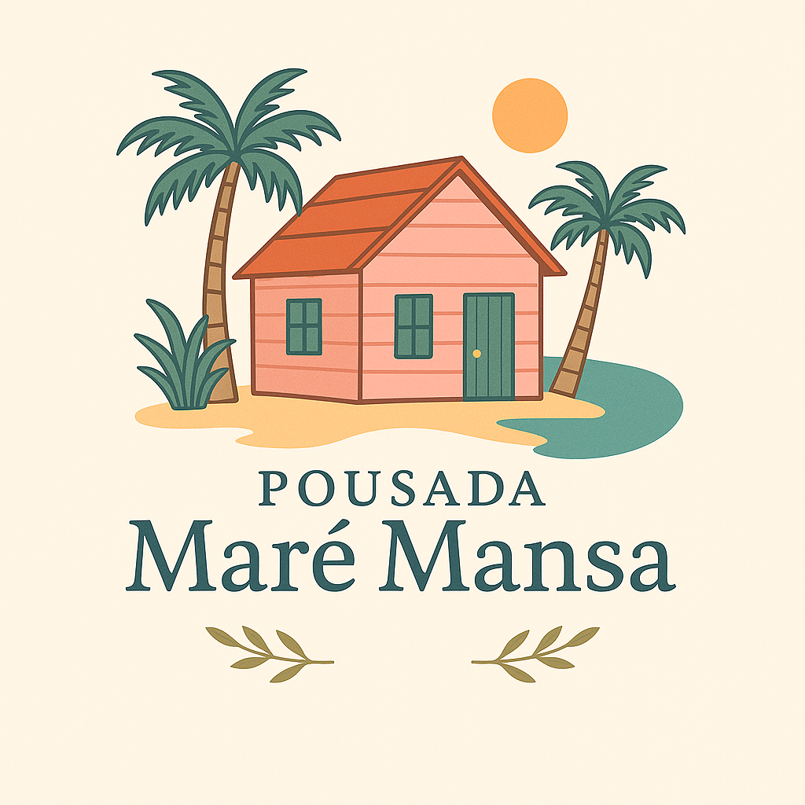

# Idiomas disponibles

| [🇺🇸 English](README-US.md) | [🇧🇷 Portuguese (Brasil)](README.md) | [🇪🇸 Español 🌟](README-ES.md) |
|:---------------------------------------:|:----------------------------------------:|:----------------------------------------:|

---



## 🏨 Pousada Maré Mansa

Sistema de gestión para una casa de huéspedes, desarrollado con **Python**, **Tkinter** y **SQLite**, utilizando la arquitectura **MVC**.

---

## 📌 Resumen

La aplicación de escritorio facilita la administración de una casa de huéspedes, permitiendo:

- Gestión de huéspedes
- Control de horarios
- Asignación de habitaciones
- Generación de informes
- Registros de actividad

---

## 🧩 Características

| Módulo | Descripción |
|----------------|---------------------------------------------------------------------------|
| 🔐 Inicio de sesión | Autenticación de usuario |
| 📋 Menú | Navegación entre las funciones principales |
| 👤 Clientes | Registro automático por CPF durante la programación |
| 📅 Citas | CRUD de reservas con validación de fecha y disponibilidad de habitaciones |
| 🛏️ Habitaciones | Control de disponibilidad de habitaciones |
| 📈 Informes | Consulta de registros administrativos |

---

## ✅ Validaciones y reglas de negocio

- Todos los campos obligatorios están validados
- Las fechas deben ser consistentes (entrada < salida)
- La fecha de entrada y salida no puede ser anterior a la fecha actual
- La habitación debe estar disponible al momento de la programación
- CPF único por cliente
- El cliente se registra automáticamente si no existe

---

## 🧱 Arquitectura MVC

El proyecto sigue el estándar **Modelo-Vista-Controlador**, lo que garantiza claridad, organización y fácil mantenimiento.

### 🔹 Modelo

- Contiene la lógica de negocio y la persistencia de datos
- Utiliza `@dataclass` para una estructuración clara
- Ej.: `Cliente`, `Sala`, `Agendamento`

### 🔹 Controlador

- Intermedia las interacciones entre la Vista y el Modelo

- Valida los datos e invoca los métodos apropiados

- Métodos estáticos para operaciones con SQLite

- Ej.: `control_cliente.py`, `control_quarto.py`

### 🔹 Vista

- Interfaz gráfica con **Tkinter**

- Diseño compacto y estandarizado (350x300)

- Utiliza `Entry`, `Combobox`, `DateEntry`, `MessageBox`

- Ej.: `TelaLogin`, `FormsAgendamento`, `TelaMenuPrincipal`

---

## 🛠️ Tecnologías Usado

- **Python 3.6+**
- **Tkinter** — GUI
- **tkcalendar** — Selección de fecha
- **Pillow** — Manipulación de imágenes (iconos y logotipos)
- **SQLite** — Base de datos local
- **Dataclasses** — Organización del modelo

---

## 📁 Estructura de carpetas

```bash
pousada_mare_mansa/
│
├── controllers/ # Lógica intermedia (Controlador)
├── model/ # Modelos de datos y reglas de negocio (Modelo)
├── views/ # Interfaz gráfica (Vista)
├── main.py # Archivo de ejecución principal
├── LICENSE # Archivo de lectura sobre la licencia MIT
└── README.md # Proyecto Documentación
```

---

## 🚀 Cómo ejecutar el proyecto

### 1. Clonar el repositorio

```bash
gh repo clone Karlos-Eduardo-Mrqs/Pousada-Mare-Mansa

cd pousada_mare_mansa
```

### 2. Crear un entorno virtual

```bash
python -m venv .venv
```

### 3. Activar el entorno virtual

- **Windows:**

```bash
.venv\Scripts\activate
```

- **Linux/macOS:**

```bash
source .venv/bin/activate
```

### 4. Instalar las dependencias

```bash
pip install tkcalendar Pillow
```

### 5. Ejecutar Aplicación

```bash
python main.py
```

---

## 📄 Licencia

Proyecto creado con fines educativos. Puedes usarlo y modificarlo según sea necesario.

*¡No dudes en abrir problemas, enviar solicitudes de extracción o simplemente compartir ideas!*

---

## 🏁 Consideraciones finales

Proyecto creado con fines educativos. Puedes usarlo y modificarlo según sea necesario.

> 🌊 ¿Listo para entrar en Pousada Maré Mansa?
