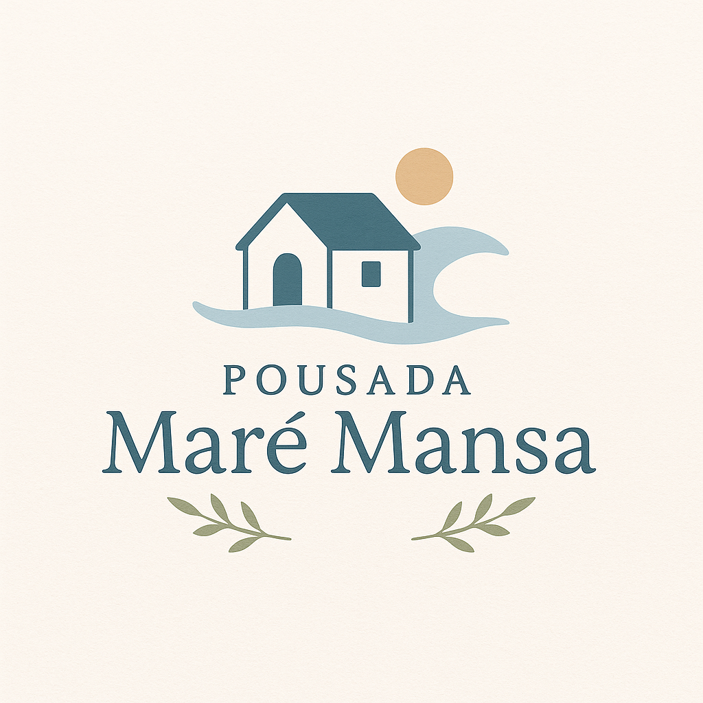
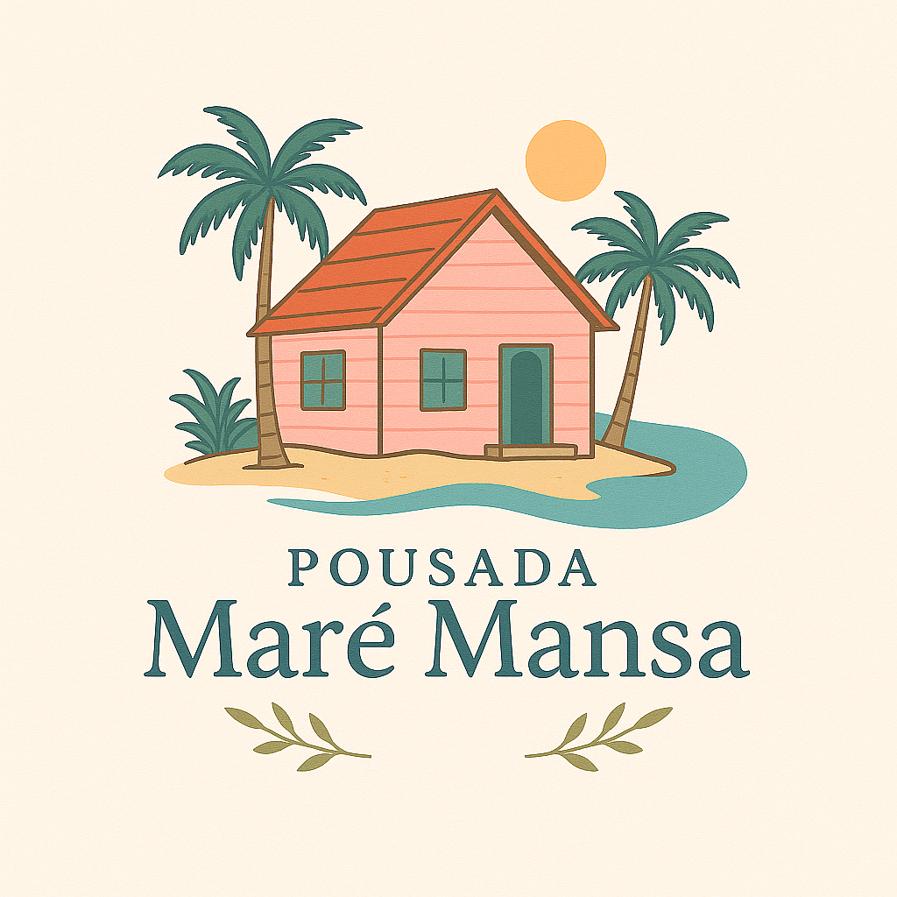

# Resumo Trabalhado - 01/05/2025

## Nome da Pousada

Durante o dia de hoje, foram avaliadas algumas opções de nome para a pousada, entre elas:

- **Pousada Recanto Sereno**
- **Pousada Maré Mansa** ✅ *(Nome final escolhido)*

## 🌊 Por que "Maré Mansa"?

O nome **Maré Mansa** foi escolhido por transmitir, de forma sensível e poética, o espírito da pousada: um lugar onde o tempo desacelera, os sentidos se acalmam e cada visitante encontra descanso em meio à natureza.

A palavra **"Maré"** remete imediatamente ao mar, ao litoral e ao movimento natural das águas — um símbolo universal de liberdade, frescor e renovação. Já **"Mansa"** evoca suavidade, serenidade e estabilidade, como uma brisa leve que acolhe sem pressa.

Juntas, essas duas palavras formam uma expressão que carrega:

- 🌿 **Calma e tranquilidade**, como o som do mar em dias de paz.  
- 🐚 **Aconchego e simplicidade**, ideais para quem busca se reconectar com o essencial.  
- 🌞 **Experiência interiorana com clima praiano**, perfeita para quem deseja escapar da rotina e encontrar conforto em um refúgio natural.

**Maré Mansa** é mais que um nome: é uma promessa de bem-estar, acolhimento e paz.

---

## Paleta de Cores Final

Para harmonizar com o conceito da Pousada Maré Mansa, foi definida a seguinte paleta de cores suave e natural:

| Cor                       | Descrição             | Hexadecimal |
|--------------------------|------------------------|-------------|
| Azul Claro (Azul Pastel) | Remete ao mar e ao céu | `#A8D8FF`   |
| Bege Claro (Areia)       | Base neutra acolhedora | `#F1E0C6`   |
| Branco Neve (Off-white)  | Limpeza e frescor      | `#F9F9F9`   |
| Verde Água (Menta)       | Conexão com a natureza | `#A8E6CF`   |
| Cinza Claro              | Toque moderno e neutro | `#D3D3D3`   |
| Madeira Natural Clara    | Aconchego e rusticidade| `#F4E1C1`   |

Essa identidade visual será aplicada tanto no ambiente físico quanto na comunicação visual da marca, refletindo o espírito acolhedor da pousada.

---

# Logos escolhidas 

## Logo Número 1

A logo da **Pousada Maré Mansa** sintetiza a ideia de tranquilidade e aconchego à beira-mar, com um estilo visual leve, flat e com charme retrô. No centro da composição está uma **casinha litorânea inspirada na casa do Mestre Kame**, situada sobre uma pequena ilha de areia clara, rodeada por um mar sereno.

A ambientação é complementada por **palmeiras tropicais** e um céu aberto em **tons suaves**, reforçando a sensação de um paraíso pacífico. A paleta calmante — com **azul pastel, bege areia, verde água, branco neve e madeira clara** — sustenta a proposta acolhedora da pousada.

A tipografia é **suave, arredondada e amigável**, garantindo leitura clara e reforçando a simplicidade do local. Ideal para ser aplicada em diversos suportes, a logo funciona como um convite visual para o descanso, o interior e o contato com a natureza.

# 📝 Resumo – Logo Número 2: *Pousada Maré Mansa*

A logo representa um **refúgio litorâneo tranquilo e acolhedor**, com estilo vintage e elementos naturais que transmitem paz e simplicidade.

---

### 🎨 Elementos principais:

- **Casa estilo Kame House**, sobre areia, como símbolo de sossego.
- **Onda suave** simbolizando a maré calma.
- **Palmeiras tropicais** reforçam o clima natural e relaxante.
- **Tipografia cursiva e amigável**, fácil de ler e acolhedora.

---

### 🌈 Paleta de Cores:

| Cor               | Código     | Uso principal                    |
|-------------------|------------|----------------------------------|
| Azul Claro        | `#A8D8FF`  | Mar e céu                        |
| Bege Claro        | `#F1E0C6`  | Areia e fundo                    |
| Verde Água        | `#A8E6CF`  | Vegetação                        |
| Madeira Clara     | `#F4E1C1`  | Casa e detalhes                  |
| Branco Neve       | `#F9F9F9`  | Iluminação                       |
| Cinza Claro       | `#D3D3D3`  | Sombras e acabamentos sutis      |

---

### ✅ Estilo e Aplicações:

- **Estilo flat e vintage**
- **Aplicável em mídias físicas e digitais**
- Transmite **calma, aconchego e conexão com a natureza**