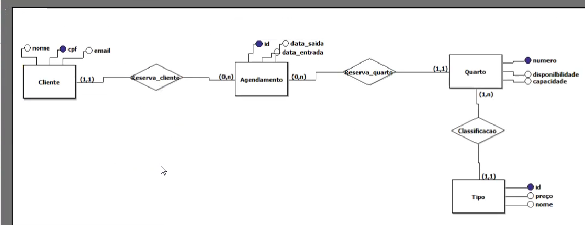

# 📝 Resumo Trabalhado - 20/05/2025

## 📦 Status Geral do Projeto

Durante o dia de hoje, o projeto da Pousada Maré Mansa avançou com importantes definições e entregas técnicas. Os marcos principais foram:

- **✅ Modelo ER (Entidade-Relacionamento) finalizado**
- **✅ Scripts SQL de criação de banco concluídos**
- **✅ Nova logo oficial definida**
- **✅ Repositório privado GitHub estruturado**
- **🧭 Planejamento do passo a passo para o desenvolvimento iniciado**

## 🎨 Atualização da Identidade Visual

A nova logo reflete com ainda mais precisão a essência da pousada: um lugar de paz, simplicidade e conexão com o litoral.

Ela mantém os principais elementos da versão anterior, mas com um layout mais equilibrado, traços refinados e uma estética ainda mais acolhedora.

**Elementos-chave:**

1. Casinha litorânea com fachada rosa e telhado rústico

2. Palmeiras tropicais simétricas e vegetação simples

3. Sol suave no horizonte

4. Estilo flat com toque vintage

5. Tipografia serifada elegante, com leitura clara

6. Ramos de folhas que simbolizam natureza e bem-estar

## 💾 Modelo de Dados – Estrutura do Banco ``pousada.db``

O modelo relacional do sistema da Pousada Maré Mansa foi implementado com o SQLite3, com as seguintes entidades principais:

**Cliente:** armazena os dados dos hóspedes (CPF, nome, e-mail).

|Campo | Tipo | Restrição |
| ----- | ---- | --------- |
| cpf   | TEXT(14) | **PK**    |
| nome  | TEXT(255) |           |
| email | TEXT(255) |           |

**Tipo:** representa o tipo de quarto, com nome e valor por diária.

| Campo | Tipo    | Restrição |
| ----- | ------- | --------- |
| id    | INTEGER | **PK**    |
| nome  | TEXT    |           |
| preco | REAL    |           |

**Quarto:** contém os dados dos quartos e a disponibilidade.

| Campo           | Tipo    | Restrição          |
| --------------- | ------- | ------------------ |
| numero          | TEXT    | **PK**             |
| disponibilidade | INTEGER    | (ex: 1, 0) |
| capacidade      | INTEGER |                    |
| id              | INTEGER | **FK → Tipo(id)**  |

**Agendamento:** registra as reservas com datas, CPF do cliente e número do quarto.

| Campo         | Tipo    | Restrição               |
| ------------- | ------- | ----------------------- |
| id            | INTEGER | **PK**                  |
| data\_entrada | TEXT    | (formato: 'YYYY-MM-DD') |
| data\_saida   | TEXT    |                         |
| cpf           | TEXT    | **FK → Cliente(cpf)**   |
| numero        | INTEGER | **FK → Quarto(numero)** |

A implementação garante integridade referencial entre as tabelas através de chaves estrangeiras. O banco encontra-se funcional e pronto para ser utilizado na fase de desenvolvimento do sistema web.

## Modelo ER 

## Como fazer um repositório privado com outras pessoas interagindo ? 

Como ter um repositório compartilhado:

1. Baixar github desktop (para maior facilidade)

2. Fazer o login com a sua conta do github

3. File >> New Repository

4. Nomeia e coloca para iniciar o repositório com um README

5. Em licença colocar a MIT License >> Create Repository

6. Publicar o Repositorio (pode ser público ou privado)

7. View on git (vai pra web)

8. Settings >> Colaborators >> Pôe a senha (se tiver) >> Adiciona as pessoas

9. As pessoas vão ser notificadas por e-mail e vão poder acessar o respositório compartilhado
Carlos vai convidar a gente e a gente acessa os códigos pelo repositório do perfil dele (isso é pra geral ter o código no final ou caso precisar pesquisar, ver variável, funções...)